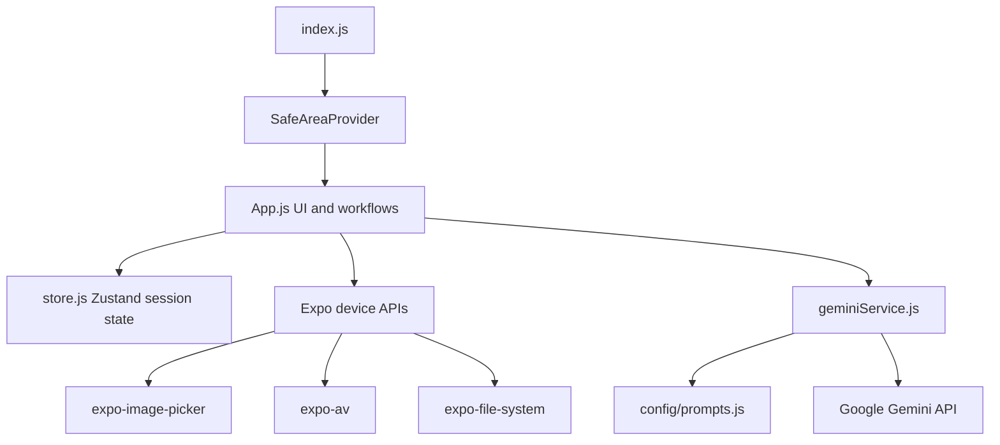

# What's For Dinner?

A React Native / Expo app that turns fridge photos, voice recordings, or manually entered ingredients into healthy dinner recipes using the Google Gemini API.

## Features

- Take a photo with your device camera or select from photo gallery to extract ingredients with Gemini.
- Record a voice note and extract spoken ingredients.
- Add and remove ingredients manually.
- Choose a cuisine preference.
- Generate a recipe from the current ingredients.
- Request a different recipe while remembering previously rejected recipes.
- Reset the cooking session when finished.
- Run on Expo Go for Android and iOS, or in a web browser.

## Requirements

- Node.js
- npm
- Expo Go compatible with Expo SDK 54 for phone testing
- A Gemini API key
- A device microphone for voice input

Android emulator development additionally requires the Android SDK and `adb` configured through `ANDROID_HOME`.

## Setup

Install dependencies from the repository root:

```powershell
npm install
```

Create a local `.env` file from the example:

```powershell
Copy-Item .env.example .env
```

Add your Gemini key to `.env`:

```env
EXPO_PUBLIC_GEMINI_API_KEY=your_gemini_api_key
```

The `.env` file is ignored by Git. Do not commit it.

## Run the App

Start the Expo development server:

```powershell
npx expo start
```

Start directly for a platform:

```powershell
npm run android
npm run ios
npm run web
```

For a phone on a different network or behind local network restrictions, use a tunnel:

```powershell
npx expo start --tunnel
```

The first tunnel run may ask to install the global `@expo/ngrok` helper. Approve that installation, then scan the public QR code shown by Expo. If port 8081 is busy, Expo will select another port.

Scan the displayed QR code with Expo Go. For web, open the web URL printed by Expo, usually `http://localhost:8081`.

If an old Expo server is using port 8081, Expo may select another port. Use the URL and QR code from the active server.

## Architecture



### Entry point: `index.js`

`index.js` registers the application with Expo. It wraps `App` in `SafeAreaProvider`, which supplies the inset context required by `SafeAreaView` on native and web.

### Screen and workflows: `App.js`

`App.js` is the current feature screen and orchestration layer. It owns temporary input state and coordinates the user actions:

- Manual input is normalized to lowercase before being added to the store.
- Image Picker selects an image as base64 data and sends it to `processFridgeImage`.
- Expo AV requests microphone permission, records AAC/M4A audio on native platforms, and records WebM audio on web.
- File System reads the recording as base64 before sending it to `processVoiceAudio`.
- Recipe actions call the Gemini service and update the store.
- Loading state controls the activity indicator while requests are running.

The component renders the ingredient list, cuisine selector, recipe card, and action buttons. It also displays user-facing alerts for permission, image, audio, and recipe failures.

### Session state: `store.js`

Zustand provides one in-memory store for the active cooking session:

| State or action | Purpose |
| --- | --- |
| `ingredients` | Current ingredient list |
| `selectedCuisine` | Current cuisine preference |
| `recipe` | Current generated recipe |
| `previousRecipes` | Titles of recipes rejected in this session |
| `loading` | Whether an AI or media operation is active |
| `addIngredient` / `removeIngredient` | Modify ingredients |
| `setRecipe` | Set the current recipe and remember the previous title |
| `resetSession` | Clear the session and restore the default cuisine |

State is in memory only. Closing or reloading the app clears the session.

### Gemini integration: `geminiService.js`

This module is the network boundary for Gemini. It builds requests, sends them with `fetch`, extracts the response text, removes optional Markdown code fences, and parses the expected JSON response.

Exports:

- `processFridgeImage(base64Image)`: returns a lowercase ingredient array.
- `processVoiceAudio(base64Audio)`: returns a lowercase ingredient array.
- `fetchRecipeFromAI(ingredients, cuisine)`: returns a recipe object.
- `fetchAlternativeRecipe(ingredients, cuisine, previousRecipes)`: returns a distinct recipe object.

The API key is read from `EXPO_PUBLIC_GEMINI_API_KEY`. Expo embeds `EXPO_PUBLIC_` values into the client bundle, so this key should be treated as a client-side key and restricted in the Google Cloud console.

### Prompt configuration: `config/prompts.js`

This module is the single source of truth for Gemini prompt text. It exports fixed prompts for image and audio extraction plus functions for prompts that need runtime values:

- `fridgeImagePrompt`
- `voiceAudioPrompt`
- `recipePrompt(ingredients, cuisine)`
- `alternativeRecipePrompt(ingredients, cuisine, previousRecipes)`

Keeping prompt construction separate from networking makes prompt changes easier to review without changing request logic.

### Audio configuration: `config/audioConfig.js`

This module defines `HIGH_QUALITY_AAC_PRESET`, a reusable set of platform-specific recording settings for Android, iOS, and web. The current screen keeps an equivalent recording configuration inline; importing this preset into `App.js` is a natural follow-up when the recording settings should have one source of truth.

## Project Layout

```text
.
├── App.js                    # Main screen and user workflows
├── index.js                  # Expo registration and safe-area provider
├── store.js                  # Zustand session store
├── geminiService.js          # Gemini API requests and response parsing
├── config/
│   ├── prompts.js            # Centralized Gemini prompts
│   └── audioConfig.js        # Platform-specific recording preset
├── assets/                   # App icons and web favicon
├── app.json                  # Expo application configuration
├── package.json              # Scripts and dependencies
├── .env.example              # Safe environment variable template
└── .gitignore                # Local secrets and generated files
```

## Data Flows

### Image ingredient scan

1. The user taps **Take Photo** or **Gallery**.
2. For camera: `expo-image-picker` requests camera permissions and launches the device camera.
3. For gallery: `expo-image-picker` opens the photo library.
4. `expo-image-picker` returns a base64 image from either source.
5. `App.js` calls `processFridgeImage`.
6. `geminiService.js` sends the image and configured prompt to Gemini.
7. The returned ingredient array is added to Zustand state.
8. The ingredient chips update in the UI.

### Voice ingredient scan

1. The user grants microphone permission and starts recording.
2. `expo-av` records the audio.
3. The recording is stopped and read as base64 by `expo-file-system`.
4. `processVoiceAudio` sends the audio and configured prompt to Gemini.
5. Returned ingredients are added to Zustand state.

### Recipe generation

1. The user selects ingredients and an optional cuisine.
2. `App.js` calls `fetchRecipeFromAI`.
3. The prompt builder inserts the current ingredients and cuisine.
4. Gemini returns the expected recipe JSON object.
5. `setRecipe` stores it and records the prior recipe title when applicable.
6. The recipe card renders the title, time, and steps.

## Useful Checks

Check Expo and dependency compatibility:

```powershell
npx expo-doctor
npm ls --depth=0
```

Create a production web export:

```powershell
npx expo export --platform web
```

Generated folders such as `node_modules/`, `.expo/`, `dist/`, and `coverage/` are ignored by Git.

## Camera Implementation

The app uses `expo-image-picker` for both camera capture and gallery selection:

- **Camera Capture**: Uses `launchCameraAsync` with `requestCameraPermissionsAsync` for permission handling
- **Gallery Selection**: Uses `launchImageLibraryAsync` for photo library access
- **Permission Handling**: Graceful user alerts for camera permission denials with settings navigation
- **Error Handling**: Proper cancellation handling when users close camera/gallery without selecting images
- **Base64 Encoding**: Both camera and gallery images are converted to base64 for Gemini API processing

### Permissions

The app requires the following permissions configured in `app.json`:

**iOS:**
- `NSCameraUsageDescription`: Camera access for taking fridge photos
- `NSPhotoLibraryUsageDescription`: Photo library access for selecting fridge photos

**Android:**
- `CAMERA`: Camera access
- `READ_EXTERNAL_STORAGE`: Photo library access
- `WRITE_EXTERNAL_STORAGE`: File system access for image processing

## Roadmap / TODO

### Phase 2 (Next)

- Smart pantry inventory and dynamic status UX updates.

### Phase 3

- Automated scheduled fridge snapshots and macro/dietary filters.

### Phase 4

- Native iOS App Store release and auto-generated shopping lists.

## Notes

- Use an Expo Go build compatible with SDK 54.
- Native camera and microphone behavior must be tested on a physical device or configured emulator.
- `expo-av` is used for the current recording workflow and is deprecated in newer Expo SDKs; migrating to `expo-audio` should be treated as a future upgrade task.
- The current app sends Gemini requests directly from the client. A production release should use a backend proxy so the API key is not distributed in the application bundle.
- The Gemini response format is parsed as JSON. Changes to prompts or model output should preserve the documented array and recipe object shapes.
